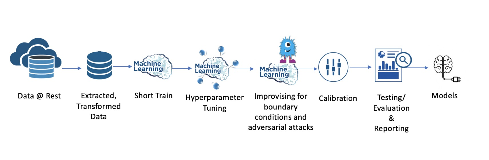
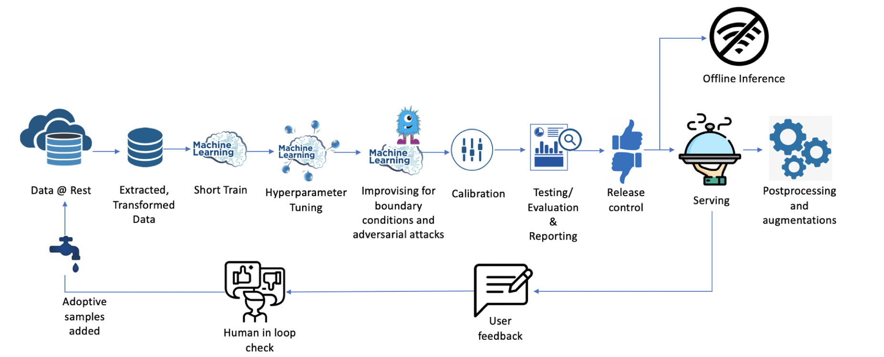
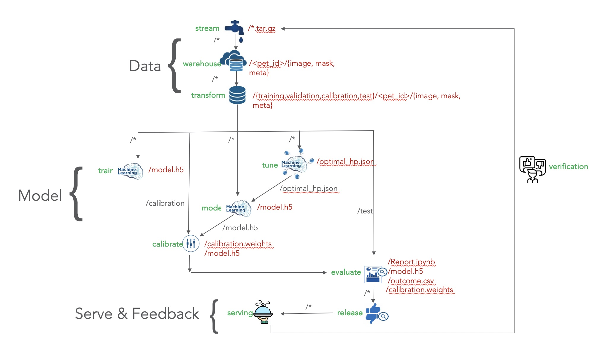
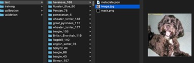
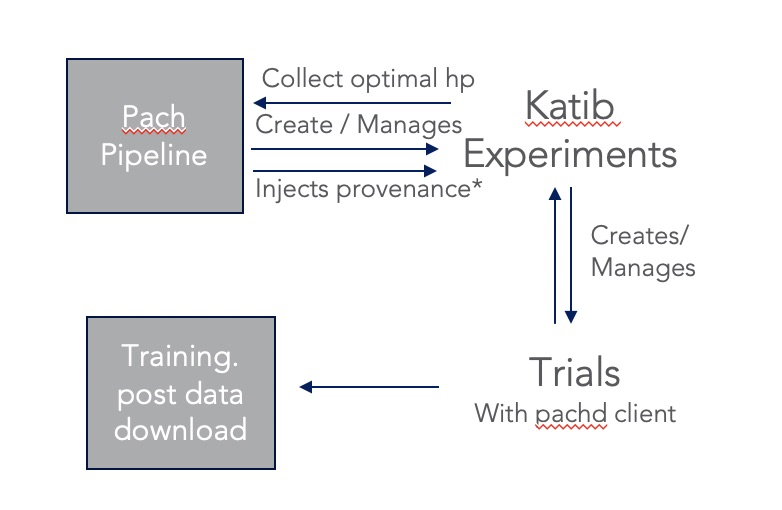
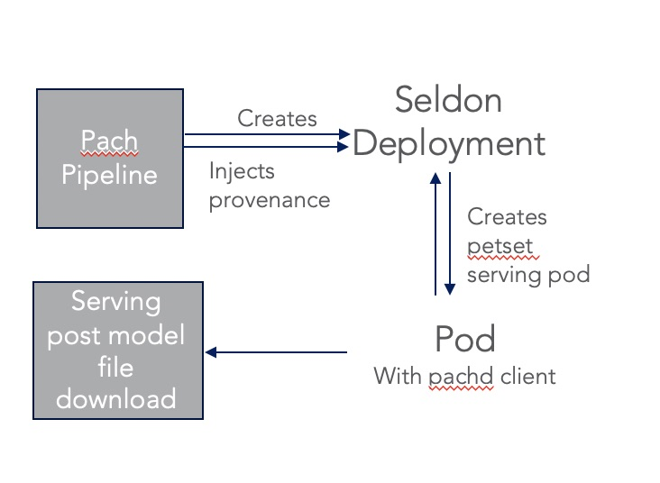

# Machine Learning Workflow

More commonly, a machine learning workflow is envisaged as following, where end goal is to arrive at a model that gives satisfactory outcome on test/evaluation set.



However, in reality, the buck does not stop at model. It actually stops at end user consuming a usable outcome. In fact, the buck never stops because in reality, 
we need to continually keep improving and updating the model with constant stream of feedback through incoming and/or adaptive samples. So, the real workflow looks somewhat as following:
   



## Introduction

This "End to End Reproducible Machine Learning on Kubernetes" sample is written to adopt semantic segmentation of Pet dataset into above workflow. Also, 
to demonstrate how without changing much in the application code, full provenance can be maintained.  

The bulk of the provenance is managed by [Pachyderm](https://github.com/pachyderm/pachyderm) with versioning of infrastructure managed in github via [ArgoCD](https://argoproj.github.io/argo-cd)
using [gitops](https://www.weave.works/technologies/gitops/) concepts. For machine learning operators, [Kubeflow](https://github.com/kubeflow/kubeflow) is used.  

Pachyderm pipeline spec is [here](cluster-conf/k8s/ml-workflow/pachyderm-specs.yaml). Extension to this specification is found [here](cluster-conf/k8s/ml-workflow/extend_pachyderm-specs-with-kubeflow.yaml) that creates Katib
experiments for tuning.  

High level overview of pipeline and dataflow is following:



## Stream source for data

Named `stream` this step emulates to use case of constant inflow in pet dataset. This is very dummy (for demonstration) as it just grabs a dump of same static dataset.

Pachyderm pipeline spec for this step is:
```yaml
pipeline:
  name: stream
transform:
  image: suneetamall/pykubectl:1.14.7
  cmd:
  - "/bin/bash"
  stdin:
  - "wget -O images.tar.gz https://www.robots.ox.ac.uk/~vgg/data/pets/data/images.tar.gz && \
     wget -O annotations.tar.gz https://www.robots.ox.ac.uk/~vgg/data/pets/data/annotations.tar.gz && \
     tar -cvf data.tar.gz *.tar.gz && \
     cat data.tar.gz > /pfs/out && \
     while :; do sleep 2073600; done"
spout:
  overwrite: true
```

## Data @ Rest

Named `warehouse` [this step](app/download_petset.py) emulates to data @ rest. Its possible to hold data externally to Pachyderm with Pachyderm only holding reference to the dataset. 


Pachyderm pipeline spec for this step is:
```yaml
input:
  pfs:
    glob: /
    repo: stream
pipeline:
  name: warehouse
transform:
  cmd:
  - "/bin/bash"
  image: suneetamall/e2e-ml-on-k8s:1
  stdin:
  - "python download_petset.py --input /pfs/stream/ --output /pfs/out"
datum_tries: 2
```

## Transform

Named `transform` [this step](app/dataset_gen.py) partitions the pet set data into 4 splits required for training, validation, calibration and test based on a reproducible partitioning strategy used [here](https://github.com/suneeta-mall/e2e-ml-on-k8s/blob/master/app/dataset_gen.py#L85-L84).
```python
int(hashlib.md5((os.path.basename(petset_id)).encode()).hexdigest(), 16) % 10
```  



All model related operations then pins to this repository for processing. Pachyderm pipeline spec for this step is:
```yaml
input:
  pfs:
    glob: "/"
    repo: warehouse
pipeline:
  name: transform
transform:
  cmd:
  - "/bin/bash"
  image: suneetamall/e2e-ml-on-k8s:1
  stdin:
  - "python dataset_gen.py --input /pfs/warehouse --output /pfs/out"
datum_tries: 2
```

## Short Test Train
Named `train` [this step](app/train.py) is just short train cycle.
```yaml
input:
  pfs:
    glob: "/"
    repo: transform
pipeline:
  name: train
transform:
  cmd:
  - "/bin/bash"
  image: suneetamall/e2e-ml-on-k8s:1
  stdin:
  - "python train.py --input /pfs/transform --output /pfs/out --checkpoint_path /pfs/out/ckpts --tensorboard_path /pfs/out"
resource_requests:
  memory: 2G
datum_tries: 2
```

## Hyper parameter tuning
This step perform hyper parameter tuning using [Hyperband](https://arxiv.org/abs/1603.06560) Bandit-Based technique. 

Two possible approaches this demo has been performed doing this: 1) Using [Ray](https://ray.readthedocs.io/en/latest/tune.html) in container and 
2) With [Katib](https://github.com/kubeflow/katib) 

### In container training With Ray
Named `tune` [this step](app/tune.py) is perform hyper parameter tuning in container using [Ray](https://ray.readthedocs.io/en/latest/tune.html)'s 
scheduling and parameter search library. 

Pachyderm pipeline spec for this step is:
```yaml
input:
  pfs:
    glob: "/"
    repo: transform
pipeline:
  name: tune
transform:
  cmd:
  - "/bin/bash"
  image: suneetamall/e2e-ml-on-k8s:1
  stdin:
  - "python tune.py --input /pfs/transform --output /pfs/out"
resource_requests:
  memory: 4G
  cpu: 1
datum_tries: 2
```

### With Katib

Named `tune-kf` [this step](app/tune_katib.py) is perform hyper parameter tuning using [Katib](https://github.com/kubeflow/katib)'s scheduling and parameter search algorithms of experiments. 

This step is defined in [here](cluster-conf/k8s/ml-workflow/extend_pachyderm-specs-with-kubeflow.yaml). From Pachyderm pipeline, provenance i.e. version of current process and input data
is [injected](https://docs.pachyderm.com/reference/pipeline_spec/#environment-variables) into Katib experiments. Upon creation of trials, Pachyderm client is used to download the dataset and tuning is performed.

This flow is as following:


  
The experiment template used can be found [here](pypkg/pylib/templates/katib-hp-tunning.yaml). This step pod with not use the data but the pods started by Katib trials will use the data, for this reason `empty_files` 
mode is used for downloading data. Also, note the use of `ml-user` defined [here](cluster-conf/ml-user/rbac-for-ml-user.yaml)

Pachyderm pipeline spec for this step is:
```yaml
input:
  pfs:
    glob: "/"
    empty_files: true
    repo: transform
pipeline:
  name: tune-kf
transform:
  cmd:
  - "/bin/bash"
  image: suneetamall/e2e-ml-on-k8s:1
  stdin:
  - "python tune_katib.py --input /pfs/transform --output /pfs/out"
pod_spec: '{"serviceAccount": "ml-user", "serviceAccountName": "ml-user"}'
datum_tries: 2
```

## Model
Named `model` [this step](app/train.py) is used to perform the training on optimal hyper parameters.  

Pachyderm pipeline spec for this step is:
```yaml
input:
  cross:
    - pfs:
       glob: "/"
       repo: transform
    - pfs:
        glob: "/optimal_hp.json"
        repo: tune
pipeline:
  name: model
transform:
  cmd:
  - "/bin/bash"
  image: suneetamall/e2e-ml-on-k8s:1
  stdin:
  - "python train.py --input /pfs/transform --hyperparam_fn_path /pfs/tune/optimal_hp.json
     --output /pfs/out --checkpoint_path /pfs/out/ckpts --tensorboard_path /pfs/out"
  - "ln -s /pfs/tune/optimal_hp.json /pfs/out/optimal_hp.json"
resource_requests:
  memory: 2G
datum_tries: 2
```

## Calibration
Named `calibrate` [this step](app/calibrate.py) is used to well `calibrate` the model.
This step also uses deduplication logic of pachyderm to hold reference to same model help in `model` step.
Pachyderm pipeline spec for this step is:
```yaml
input:
  cross:
    - pfs:
       glob: "/calibration"
       repo: transform
    - pfs:
        glob: "/model.h5"
        repo: model
pipeline:
  name: calibrate
transform:
  cmd:
  - "/bin/bash"
  image: suneetamall/e2e-ml-on-k8s:1
  stdin:
  - "python calibrate.py --input /pfs/transform --model_weight /pfs/model/model.h5 --output /pfs/out"
  - "ln -s /pfs/model/model.h5 /pfs/out/model.h5"
datum_tries: 2
```

## Evaluate 
Named `evaluate` [this step](app/evaluate.py) is used to test the calibrated model and to generate the report and outcome records.

This step also uses deduplication logic of pachyderm to hold reference to same model held in `model` step and `calibration model` in `calibrate` step.

Pachyderm pipeline spec for this step is:
```yaml
input:
  cross:
    - pfs:
       glob: "/test"
       repo: transform
    - pfs:
        glob: "/"
        repo: calibrate
pipeline:
  name: evaluate
transform:
  cmd:
  - "/bin/bash"
  image: suneetamall/e2e-ml-on-k8s:1
  stdin:
  - "papermill evaluate.ipynb /pfs/out/Report.ipynb \
      -p model_weights /pfs/calibrate/model.h5 \
      -p calibration_weights /pfs/calibrate/calibration.weights \
      -p input_data_dir /pfs/transform \
      -p out_dir /pfs/out \
      -p hyperparameters /pfs/calibrate/optimal_hp.json"
  - "ln -s /pfs/calibrate/model.h5 /pfs/out/model.h5"
  - "ln -s /pfs/calibrate/calibration.weights /pfs/out/calibration.weights"
resource_requests:
  memory: 1G
datum_tries: 2
```

## Release 
Named `release` [this step](app/release.py) is expected to test against boundary condition and performance of model. Upon satisfactory results, 
this step will go out and start a [Seldon](https://github.com/SeldonIO/seldon-core/) deployment for model serving. Note the use of `ml-user` defined [here](cluster-conf/ml-user/rbac-for-ml-user.yaml)  

[This](pypkg/pylib/templates/model-serving.yaml) serving deployment spec has been used in this case. The internals of how provenance is injected is as shown:



Pachyderm pipeline spec for this step is:
```yaml
input:
  pfs:
    glob: "/"
    repo: evaluate
pipeline:
  name: release
transform:
  cmd:
  - "/bin/bash"
  image: suneetamall/e2e-ml-on-k8s:1
  stdin:
  - "python release.py --model_db evaluate --input /pfs/evaluate/evaluation_result.csv --version ${evaluate_COMMIT}"
pod_spec: '{"serviceAccount": "ml-user", "serviceAccountName": "ml-user"}'
datum_tries: 2
```

## Serving & Feedback loop
This concept is bundled in served model. The model is served on versioned API and feedback API is used for sample collection. The feedback loop is stubbed out.

