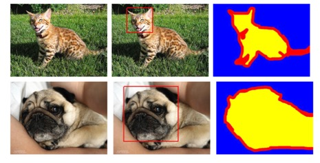

# End to End Reproducible Machine Learning on Kubernetes

This application is sample app created to demonstrate how to realizing end to end reproducible machine learning on Kubernetes. 
This was referenced in [KubeCon US 2019 @ San Diego](https://sched.co/UacQ). Slides for this is available [here](https://suneeta-mall.github.io/talks/KubeCon_US_2019.html).

## Model Network
At core, this application solves a deep learning semantic segmentation problem using [U-Net](https://arxiv.org/abs/1505.04597) with [MobileNetV2](https://arxiv.org/abs/1801.04381) or [VGG-19](https://arxiv.org/abs/1409.1556) convolution network as backbone. 
The model is inspired from [this tensorflow demo example](https://www.tensorflow.org/tutorials/images/segmentation) but is modified further for bunch of other things. 

## The Data
The end to end example is tested with [Oxford Universities Pet Dataset](https://www.robots.ox.ac.uk/~vgg/data/pets/) that segments pets image into 3 non-overlapping categories a) Pet, b) Background and 3) Unknown



However the code has been used in multi-label scenario.  

## Sample structure
All the top level python script for this project is in [app](app) whereas library [pylib](pypkg/pylib) wraps core functionality. 
Dockerfile can be found [here](Dockerfile). 
[End to end](run_e2e.sh) can be used to run this end to end locally/in container.

## Environment Setup

### Kubernetes 
Reproducibility starts with environment. The whole cluster including application runtime needs to be version controlled. 
This app uses [gitops](https://www.weave.works/technologies/gitops/) concept to version environment. To realize [gitops](https://www.weave.works/technologies/gitops/),
it defined [ArgoCD](https://argoproj.github.io/argo-cd) apps to setup on any Kubernetes cluster. 

 

The [ArgoCD App](cluster-conf/e2e-ml-argocd-app.yaml) installs the following:

- [Kubeflow](https://github.com/kubeflow/kubeflow) 0.6.2
- [Pachyderm](https://github.com/pachyderm/pachyderm) 1.9.8
- [Seldon](https://github.com/SeldonIO/seldon-core) 0.4.1
- [Istio](https://github.com/istio/istio) 1.1.0
- A ML-User [RBAC](https://kubernetes.io/docs/reference/access-authn-authz/rbac/) to execute ML Operators defined by [Kubeflow](https://github.com/kubeflow/kubeflow)

Due to above installation following capabilities are present in cluster:
- Jupyter Notebook via [Kubeflow](https://github.com/kubeflow/kubeflow)
- Training frameworks TFJob, TorchJob etc. via [Kubeflow](https://github.com/kubeflow/kubeflow)
- DAG pipelines:  [Kubeflow pipelines](https://github.com/kubeflow/pipelines), [Pachyderm](https://github.com/pachyderm/pachyderm), [Argo](https://github.com/argoproj/argo)
- Hyper Parameter Tuning:  [Katib](https://github.com/kubeflow/katib), [Ray](https://ray.readthedocs.io/en/latest/tune.html)
- Serving ([Seldon](https://github.com/SeldonIO/seldon-core), TFServe etc.)
- Service Mesh: [Istio](https://github.com/istio/istio)


More information & specifics about configuring infrastructure and all k8s related runtime is located in [cluster-conf](cluster-conf). See [readme](cluster-conf/README.md) for more information.

### Local Environment
Easiest way to setup is using docker image `suneetamall/e2e-ml-on-k8s` from [dockerhub](https://hub.docker.com/repository/docker/suneetamall/e2e-ml-on-k8s)
However, to create  local environment see:

#### Creating Python Environment:
This app was worked with `conda 4.7.11` and `Python 3.7.3`. But spec of environment is detailed [here](environment.yml)
and can be used to create virtual environment file as following:
```bash
    conda env create -f environment.yml
```
For more details on this see [here](https://docs.conda.io/projects/conda/en/latest/user-guide/tasks/manage-environments.html#create-env-from-file)

If using virtualenv,
```bash
virtualenv tf2 --python=python3.7.3
source tf2/bin/activate
``` 
requirements are listed [here](requirements.txt) with `pylib` located in [pylib](pypkg/setup.py).

## Demo


See [ml-workflow](ML_WORKFLOWS.md) for information on individual steps of above workflow.   

Finally, see [demo notebook](demo.ipynb)
